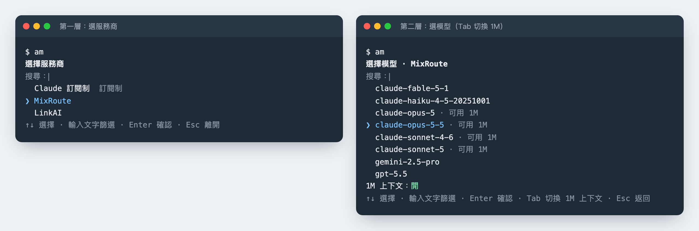
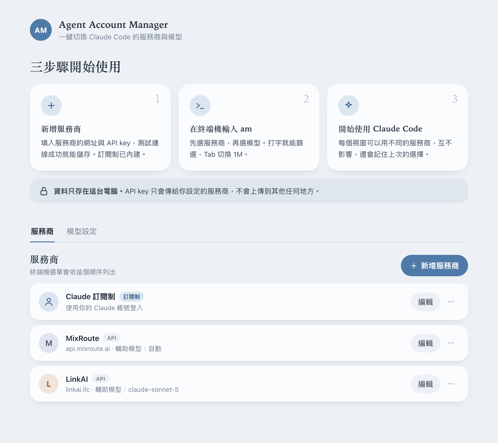

# AM · Agent Account Manager

在終端機輸入 `am`，就能選擇要用哪個服務商、哪個模型來啟動 Claude Code，不用每次手動切換 API key。

- 支援 Claude 訂閱制，以及提供 Anthropic 相容 API 的第三方服務商（例如 MixRoute、LinkAI）。
- 每個終端視窗可以各用不同的服務商與模型，互不影響。
- 開啟選單時即時查詢服務商目前可用的模型，服務商換模型也不用改設定。
- 在本機的管理網站新增、編輯服務商，不用手動改設定檔。

支援 macOS（Apple 晶片、Intel）與 Windows。使用前需先安裝 [Claude Code](https://claude.com/claude-code)。

**終端機選單**：先選服務商，再選模型



**管理網站**：在瀏覽器新增、編輯服務商



## 安裝

**macOS**：打開「終端機」，貼上這行後按 Enter：

```sh
curl -fsSL https://raw.githubusercontent.com/coollazy/AM/master/scripts/install/install.sh | sh
```

**Windows**：打開「PowerShell」，貼上這行後按 Enter：

```powershell
irm https://raw.githubusercontent.com/coollazy/AM/master/scripts/install/install.ps1 | iex
```

安裝腳本會自動判斷電腦類型、下載最新版、檢查檔案完整性並設定好 PATH，最後詢問要不要開啟開機自動執行、要不要立即打開管理網站。

- macOS 安裝到 `~/.local/bin/am`，Windows 安裝到 `%LOCALAPPDATA%\Programs\am\am.exe`。
- macOS 安裝後請**新開一個終端機視窗**再使用 `am`；Windows 在同一個視窗就能直接使用。
- **更新**：重新執行同一行指令即可。會先停止執行中的管理網站再替換，並保留開機自動執行的設定。
- **安裝指定版本**：macOS 在 `sh` 前加上 `AM_VERSION=v1.1.0`，例如 `curl -fsSL … | AM_VERSION=v1.1.0 sh`；Windows 先執行 `$env:AM_VERSION="v1.1.0"`。

<details>
<summary>不想用一行指令？手動下載安裝</summary>

到 [Releases](https://github.com/coollazy/AM/releases/latest) 下載符合你電腦的壓縮檔並解壓縮：

| 電腦 | 檔案 |
|---|---|
| Mac（Apple 晶片，M1 之後） | `am-macos-arm64.zip` |
| Mac（Intel） | `am-macos-x64.zip` |
| Windows | `am-windows-x64.zip` |

- macOS：在終端機進入解壓縮後的資料夾，執行 `./install.sh`。
- Windows：在 PowerShell 進入解壓縮後的資料夾，執行 `powershell -ExecutionPolicy Bypass -File .\install.ps1`。Windows 可能跳出「Windows 已保護您的電腦」，點「其他資訊」→「仍要執行」。

可用 `SHA256SUMS.txt` 核對下載檔案是否完整。
</details>

## 使用

1. 開啟管理網站，新增服務商：

   ```sh
   am web
   ```

   填入名稱、API 網址與 API key 後，按「測試連線」確認可以取得模型清單再儲存。

2. 設定開機自動執行管理網站（選擇性）：

   ```sh
   am autostart on
   ```

3. 啟動 Claude Code：

   ```sh
   am
   ```

   - 第一層選服務商；選訂閱制會直接啟動。
   - 第二層選模型：方向鍵選擇，直接打字篩選，`Tab` 切換 1M 上下文，`Esc` 返回。
   - 會記住每個服務商上次選的模型，下次預設停在那裡。

`am` 後面的參數會原樣交給 Claude Code，例如 `am --resume`。

## 指令

| 指令 | 用途 |
|---|---|
| `am [claude 參數...]` | 選擇服務商與模型後啟動 Claude Code |
| `am web` | 用瀏覽器開啟管理網站（未執行時自動啟動） |
| `am server` | 在前景執行管理網站 |
| `am autostart on` / `off` / `status` | 開啟、關閉、查看開機自動執行 |
| `am uninstall` | 解除安裝（詢問是否一併刪除設定與 API key；`--yes` 不詢問、`--purge` 刪除設定、`--keep-config` 保留設定） |
| `am -- <參數...>` | 參數與上述子指令同名時，用這個方式交給 Claude Code |
| `am --version` | 顯示版本 |

## 解除安裝

```sh
am uninstall
```

會停止管理網站、關閉開機自動執行、移除安裝腳本加入的 PATH 設定並刪除執行檔。預設保留設定（`~/.am`），重新安裝後可以繼續使用；想一併刪除設定與 API key，回答「y」或加上 `--purge`。

## 設定與安全

- 設定存在 `~/.am/config.json`（Windows：`%USERPROFILE%\.am\config.json`），包含 API key，macOS 上只有你自己能讀取。
- 管理網站只接受本機連線（`http://127.0.0.1:4141`），並拒絕來自其他網站的請求。
- 啟動 Claude Code 時，AM 只會調整下列環境變數，其他環境變數維持不變：
  `ANTHROPIC_BASE_URL`、`ANTHROPIC_AUTH_TOKEN`、`ANTHROPIC_API_KEY`、`ANTHROPIC_MODEL`、`ANTHROPIC_DEFAULT_HAIKU_MODEL`、`CLAUDE_CODE_MAX_OUTPUT_TOKENS`、`CLAUDE_CODE_MAX_CONTEXT_TOKENS`。

## 開發

需要 [Bun](https://bun.sh)。

```sh
bun install
bun test              # 單元測試
bun run typecheck     # 型別檢查
bun run dev           # 開發模式執行管理網站
bun run package       # 產出所有平台的安裝包到 dist/release/
bun run screenshots   # 重新產生 README 截圖（docs/images/，需要 Google Chrome）
```

### 發布新版本

1. 更新 `package.json` 的 `version`，合併到 `master`。
2. 打上相同版本的 tag 並推送，例如 `git tag v1.1.0 && git push origin master v1.1.0`。
3. GitHub Actions（`.github/workflows/release.yml`）會自動測試、打包並建立 Release。

架構說明見 [`docs/architecture.md`](docs/architecture.md)。
